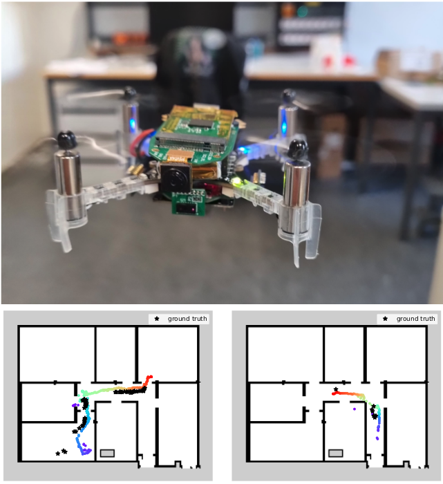

# Fully Onboard Low-Power Localization with Semantic Sensor Fusion on a Nano-UAV using Floor Plans
This repository contains the implementation of the following publication - Arxiv link coming soon!
```bibtex
@article{zimmerman2024icra,
  title = {{Fully Onboard Low-Power Localization with Semantic Sensor Fusion on a Nano-UAV using Floor Plans}},
  author  = {Zimmerman, Nicky and Müller, Hanna and Magno, Michele and Benini, Luca},
  journal = {{arXiv preprint:XXXX.XXXXX}},
  year    = {2023}
}
```

## Abstract
Nano-sized unmanned aerial vehicles (UAVs) are well-fit for indoor applications and for close proximity to humans. To enable autonomy, the nano-UAV must be able to self-localize in its operating environment. This is a particularly-challenging task due to the limited sensing and compute resources on board. This work presents an online and onboard approach for localization in floor plans annotated with semantic information. Unlike sensor-based maps, floor plans are readily-available, and do not increase the cost and time of deployment. To overcome the difficulty of localizing in sparse maps, the proposed approach fuses geometric information from miniaturized time-of-flight sensors and semantic cues. The semantic information is extracted from images by deploying a state-of-the-art object detection model on a high-performance multi-core microcontroller onboard the drone, consuming only 2.5mJ per frame and executing in 38ms. In our evaluation, we globally localize in a real-world office environment, achieving 90\% success rate. 

<p align="center">

</p>

## Results
Our live demos for semantic localization on the Bitcraze Crazyflie 2.1 can seen in the following video:
[](https://www.youtube.com/watch?v=03l6LVqv4VA "SMCL")

## Installation 
To compile the code, you must first install the GAP9 SDK. If you don't have access to it, you can contact [GreenWaves Technologies](https://greenwaves-technologies.com/gap9-docs/).
After installing the SDK and sourcing the platform through the sourcme.sh file, you can compile the code by running 
```bash
make run all
```
In the `code/smcl_yolo_fused/gap9` folder. 

## Usage 
The approach is meant to be executed onboard, using the input from the sensors. 
The semantic maps and the EDT are precomputed, and should be included as headers. For an example, check `code/smcl_yolo_fused/gap9/data`.
The algorithm can also be executed offline, using the define `RUN_FROM_FILE`, by including header files containing the odometry, ToF data and semantic inference results. 
For odometry, stored in odom.h, the format is (timestamp, x, y, z, roll, pitch, yaw)
~~~
float input_odom[][7] = {{ 87039.425, 0.062074657529592514, -0.042810533195734024, 0.9081470966339111, 0.0037804164643136244, 0.0005255762715359263, -0.011048510772789621 }, 
{ 87104.75, 0.06328467279672623, -0.052654676139354706, 0.9089760184288025, 0.0019638086160034627, -0.0009577535460890509, -0.012120721273898839 }, 
{ 87170.121, 0.03765188530087471, -0.05799685791134834, 0.9153720736503601, -0.0014738179242735822, -7.475267565375308e-05, -0.012934912036974113 }};
~~~ 
For the ToF data, stored in scan.h, the data is organized as timestamp, 64 elements of the front ToF, and then 8 elements from right, rear and left ToF 
~~~
float input_scan[][89] = {{ 87039.425, 0.0, 0.0, 0.0, 0.0, 0.0, 0.0, 0.0, 0.0, 0.0, 0.0, 0.0, 0.0, 0.0, 0.0, 0.0, 0.0, 1.718000054359436, 0.0, 0.0, 0.0, 0.0, 0.0, 3.0950000286102295, 0.0, 1.722000002861023, 1.7660000324249268, 0.0, 0.0, 0.0, 3.197000026702881, 0.0, 0.0, 1.7289999723434448, 1.7369999885559082, 0.0, 0.0, 0.0, 0.0, 0.0, 0.0, 1.746999979019165, 1.6749999523162842, 0.0, 0.0, 0.0, 0.0, 0.0, 0.0, 1.777999997138977, 1.63100004196167, 0.0, 0.0, 0.0, 0.0, 2.2739999294281006, 2.2320001125335693, 0.0, 1.656999945640564, 0.0, 0.0, 1.527999997138977, 0.0, 0.0, 0.0, 1.2489999532699585, 1.2059999704360962, 1.1799999475479126, 1.1629999876022339, 1.1330000162124634, 1.1050000190734863, 1.0759999752044678, 1.059000015258789, 0.0, 0.859000027179718, 0.0, 0.8669999837875366, 0.8619999885559082, 0.8579999804496765, 0.0, 0.0, 0.0, 0.0, 0.0, 0.0, 0.0, 2.312000036239624, 2.194000005722046, 0.0 }};
~~~
For the semantic inference data, stored in sem_q.h, the format is timestamp, the number of detected objects, and the a list of detections (class, x, y, w, h, confidence)
~~~
float detection_input[][62] = {{ 24440.0, 1, 8, 90, 0, 256, 56, 0.8425, 0.0, 0.0, 0.0, 0.0, 0.0, 0.0, 0.0, 0.0, 0.0, 0.0, 0.0, 0.0, 0.0, 0.0, 0.0, 0.0, 0.0, 0.0, 0.0, 0.0, 0.0, 0.0, 0.0, 0.0, 0.0, 0.0, 0.0, 0.0, 0.0, 0.0, 0.0, 0.0, 0.0, 0.0, 0.0, 0.0, 0.0, 0.0, 0.0, 0.0, 0.0, 0.0, 0.0, 0.0, 0.0, 0.0, 0.0, 0.0, 0.0, 0.0, 0.0, 0.0, 0.0, 0.0 }};
~~~
We limmited the number of detections to 10 per image.

